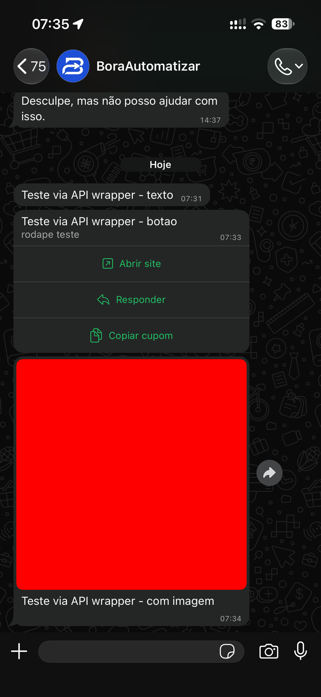
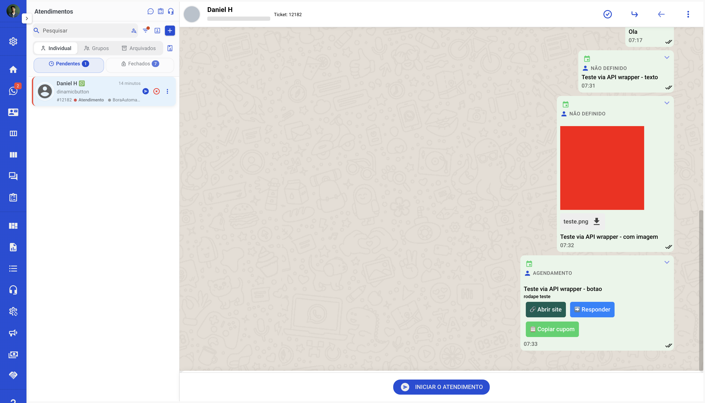

# Whazing — API de Agendamento de Mensagem

Wrapper não-oficial que adiciona **agendamento de mensagem** (texto, arquivo e botões interativos) à plataforma [Whazing](https://github.com/cleitonme/Whazing-SaaS) — recurso que a API oficial do Whazing ainda não tem ([issue #479](https://github.com/cleitonme/Whazing-SaaS/issues/479)).

Não modifica o backend do Whazing: escreve direto na tabela `Schedules` do Postgres, que o próprio job `VerifySchedules` do backend já varre e processa — o mecanismo de disparo é 100% do Whazing, essa API só cria o agendamento.

## Como funciona

```
Cliente (agente, n8n, etc.)
        │  POST /agendar  (Bearer token = mesmo token da API oficial do Whazing)
        ▼
agendamento-api (este projeto)
        │  INSERT INTO "Schedules" (status='PENDENTE', sendAt=...)
        │  se tiver arquivo: salva em /app/public/{tenantId}/schedule/{AAAAMM}/
        ▼
Postgres do Whazing
        │
        ▼
Job VerifySchedules (backend do Whazing, já existente)
        │  varre status='PENDENTE' AND sendAt <= now()
        ▼
WhatsApp do cliente final
```

Autenticação reaproveita o mesmo JWT que a API oficial de mensagens do Whazing usa (gerado em Configurações → canal → API) — decodifica com o `JWT_SECRET` do backend e confirma o token ativo na tabela `ApiConfigs`. Nenhum token novo é gerado.

## Uso da API

Ver [`api.md`](./api.md) — formatos de requisição (texto, arquivo, botões), campos, respostas e exemplos cURL.

## Contexto e decisões de projeto

Ver [`planejamento.md`](./planejamento.md) — como o formato de `mediaPath`/`mediaName`/`templateComponents` foi descoberto empiricamente, arquitetura, riscos conhecidos.

## Rodando

### Docker (recomendado)

```bash
docker build -t agendamento-api:latest .
docker run -p 5000:5000 \
  -e DB_HOST=postgres \
  -e DB_PASSWORD=senha_do_postgres \
  -e JWT_SECRET=mesmo_secret_do_backend_whazing \
  -v /caminho/whazing/backend/public:/app/public \
  agendamento-api:latest
```

### Local

Requisitos: Python 3.10+

```bash
python3 -m venv venv
source venv/bin/activate
pip install -r requirements.txt

export DB_HOST=localhost
export DB_PASSWORD=senha_do_postgres
export JWT_SECRET=mesmo_secret_do_backend_whazing
export PUBLIC_DIR=/caminho/whazing/backend/public

flask --app main run --host 0.0.0.0 --port 5000
```

## Configuração

| Variável | Obrigatória | Padrão | Descrição |
|---|---|---|---|
| `DB_HOST` | não | `postgres` | Host do Postgres do Whazing |
| `DB_PORT` | não | `5432` | Porta do Postgres |
| `DB_USER` | não | `whazing` | Usuário do Postgres |
| `DB_PASSWORD` | **sim** | — | Senha do Postgres |
| `DB_NAME` | não | `postgres` | Nome do banco |
| `JWT_SECRET` | **sim** | — | Mesmo `JWT_SECRET` do `.env` do backend do Whazing — usado pra validar o token Bearer |
| `PUBLIC_DIR` | não | `/app/public` | Diretório público do backend do Whazing (montar o mesmo volume do container `whazing-backend`) — onde arquivos de agendamento são salvos |

## Produção

Deployado na mesma stack Docker Compose do Whazing (`whazing-net`), atrás de Traefik, sem porta pública direta — só acessível via subdomínio HTTPS próprio.

## Escopo atual

- ✅ Agendamento de texto
- ✅ Agendamento com arquivo (imagem, áudio, vídeo, PDF)
- ✅ Agendamento com botões interativos (link, resposta rápida, copiar texto)
- ✅ Cancelamento de agendamento pendente (`DELETE /agendar/<id>`)
- ✅ Agendamento recorrente (diário/semanal/quinzenal/mensal/bimestral/trimestral/semestral/anual)
- ❌ Templates oficiais do WhatsApp (Meta) agendados
- ❌ Edição de agendamento já criado (hoje é cancelar + criar de novo)
- ❌ Cancelamento em lote de uma recorrência inteira (hoje é um `DELETE` por `id`)

## Validado em produção (2026-08-29)

Testado de ponta a ponta — texto, arquivo e botões — e confirmado tanto no WhatsApp real quanto no painel do Whazing.

<table>
<tr>
<td width="50%"><b>WhatsApp</b><br></td>
<td width="50%"><b>Painel do Whazing</b><br></td>
</tr>
</table>
